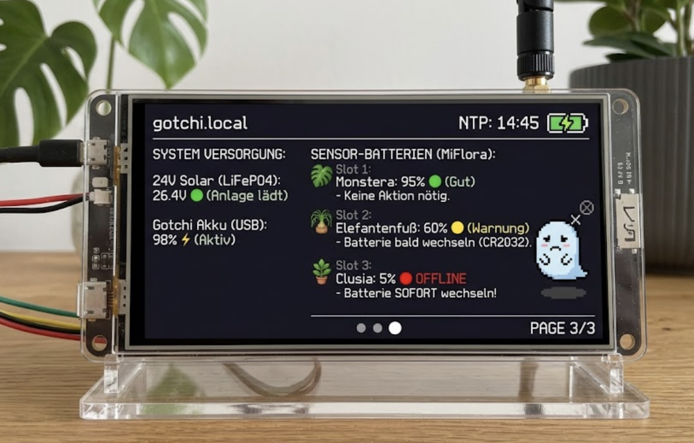

# 🪴 Plant Sensor LilyGo S3 Gotchi

Willkommen beim **Gotchi-Projekt**! Dieses Projekt verwandelt ein **LILYGO T-Display-S3** in einen praktischen kleinen Helfer, der dir auf einem Display anzeigt, wie es deinen Pflanzen geht. Es verbindet sich dazu über Bluetooth mit **Xiaomi Mi Flora** Sensoren.

Alles, was du tun musst, ist dein Gotchi mit deinem WLAN zu verbinden und die Einstellungen über eine einfache Webseite (Web-GUI) vorzunehmen – ganz ohne kompliziertes Programmieren!

---

## 🌟 Projektbeschreibung: Was kann das Gotchi?

* **Live-Daten:** Liest drahtlos Temperatur, Bodenfeuchtigkeit, Licht und Dünger (Leitfähigkeit) von bis zu 3 Mi Flora Sensoren aus.
* **Historie:** Speichert die Bodenfeuchtigkeit über die Zeit ab und zeigt dir auf einer Webseite ein anschauliches Diagramm (Chart).
* **Push-Warnungen:** Schickt dir eine Nachricht aufs Handy (via ntfy.sh), wenn eine Pflanze zu trocken ist und Wasser braucht.
* **Einfache Konfiguration:** Alle Einstellungen (Sensoren, Pflanzen-Namen, Min/Max-Werte) können bequem über den Webbrowser am PC oder Smartphone geändert werden.

---

## 🛠️ Vorbereitung: MAC-Adresse des Sensors finden

Um dem Gotchi zu sagen, mit welchem Sensor es sprechen soll, brauchst du die sogenannte "MAC-Adresse" des Sensors. Das ist wie eine Telefonnummer für Bluetooth-Geräte.

**So findest du sie heraus:**
1. Lade dir die kostenlose App **"nRF Connect for Mobile"** auf dein Smartphone herunter (verfügbar für [iOS](https://apps.apple.com/app/nrf-connect-for-mobile/id1054362403) und [Android](https://play.google.com/store/apps/details?id=no.nordicsemi.android.mcp)).
2. Gehe ganz nah an den Sensor heran, der in der Erde steckt.
3. Öffne die App und drücke oben auf **"Scan"**. *(Android: Du musst der App den Zugriff auf den Standort erlauben).*
4. In der Liste sollte nun ein Gerät namens **"Flower care"** oder **"Flower mate"** auftauchen.
5. Darunter steht eine Nummer wie `C4:7C:8D:12:34:56`. Das ist die gesuchte MAC-Adresse. **Schreibe sie dir auf!**

---

### 💻 Installation (Upload auf das Display)

Damit das Gotchi funktioniert, müssen zwei Dinge auf das LILYGO T-Display-S3 übertragen (geflasht) werden:

1. Das **Programm** selbst (Firmware).
2. Das **Dateisystem** (LittleFS), auf dem die Webseite und später deine Messdaten gespeichert werden.

Dank unserer automatischen Bereitstellung kannst du das Gotchi ganz einfach direkt über deinen Webbrowser flashen – komplett ohne Programmierkenntnisse oder Zusatzsoftware!

**Voraussetzungen:**

* Ein **Chromium-basierter Webbrowser** (Google Chrome, Microsoft Edge, Opera oder Brave). *Hinweis: Firefox und Safari unterstützen die benötigte Web-Serial-Schnittstelle leider nicht.*
* Ein USB-C Datenkabel (Achtung: Manche Kabel sind reine Ladekabel – es muss zwingend Daten übertragen können!).

**Schritt-für-Schritt Anleitung:**

1. **Dateien herunterladen:** Gehe auf der GitHub-Seite dieses Projekts rechts auf **"Releases"** und lade dir unter der neuesten Version die Datei `LilyGo_Gotchi_Firmware.zip` herunter.
2. **Entpacken:** Entpacke die ZIP-Datei auf deinem Computer. Darin befinden sich mehrere `.bin` Dateien.
3. **Web-Flasher öffnen:** Öffne in deinem Browser das offizielle Flash-Tool von Espressif: [https://espressif.github.io/esptool-js/](https://espressif.github.io/esptool-js/)
4. **Verbinden:** Schließe dein LILYGO T-Display-S3 per USB an den PC an. Klicke auf der Webseite auf den Button **"Connect"** und wähle im aufklappenden Fenster den passenden USB-Port deines Displays aus.
5. **Dateien zuweisen:** Nun musst du die entpackten `.bin` Dateien in das Tool laden und ihnen die richtigen Speicheradressen (Offsets) zuweisen. Trage die folgenden Werte ein (über "Add File" kannst du weitere Zeilen hinzufügen):
* `bootloader.bin` ➔ Flash Address: `0x0`
* `partitions.bin` ➔ Flash Address: `0x8000`
* `firmware.bin` ➔ Flash Address: `0x10000`
* `littlefs.bin` ➔ Flash Address: `0x310000` *(Adresse kann je nach exakter Partitionstabelle abweichen)*

6. **Flashen:** Klicke unten auf **"Program"**. Der Fortschrittsbalken zeigt dir an, wie die Daten übertragen werden.
7. **Neustart**: Wenn der Balken 100% erreicht hat und der Erfolgs-Dialog erscheint, versucht das Tool oft einen automatischen Neustart ("Hard resetting via RTS pin..."). Das Display sollte nun das Gotchi-Setup anzeigen. Falls der Bildschirm dunkel bleibt oder nicht reagiert, drücke einfach kurz den Reset-Knopf an der Seite deines LILYGO Displays, um es manuell neu zu starten.
---

## 🌐 Erster Start (WLAN & ntfy.sh einrichten)

Beim allerersten Start kennt dein Gotchi dein WLAN noch nicht. Es öffnet daher ein eigenes kleines WLAN-Netzwerk, um sich mit dir zu verbinden.

1. Schau auf das Display des Gotchis. Es sollte "WLAN: Gotchi-Setup..." anzeigen.
2. Nimm dein Smartphone oder deinen PC und suche nach neuen WLAN-Netzwerken.
3. Verbinde dich mit dem Netzwerk **"Gotchi-Setup"**.
4. Es öffnet sich automatisch eine Anmeldeseite (Captive Portal). Falls nicht, öffne deinen Browser und tippe `192.168.4.1` ein.
5. Klicke auf **"Configure WiFi"**.
6. Wähle dein Heim-WLAN aus und gib dein WLAN-Passwort ein.
7. Ganz unten findest du das Feld **"ntfy.sh Topic"**. Überlege dir hier ein sicheres, geheimes Wort (z. B. `mein_geheimes_gotchi_123`). Lade dir die [ntfy App](https://ntfy.sh/) auf dein Handy und abonniere exakt dieses Wort, um später Push-Nachrichten zu erhalten, wenn du gießen musst.
8. Klicke auf **Save**. Das Gotchi startet neu und verbindet sich nun mit deinem Heim-WLAN. Auf dem Display siehst du die Erfolgsmeldung!

---

## ⚙️ Konfiguration über das Web-GUI

Dein Gotchi ist nun mit dem WLAN verbunden, weiß aber noch nicht, welche Pflanzen es überwachen soll. Das ändern wir jetzt auf der Webseite des Gotchis.

1. Öffne einen Browser (am PC oder Handy) und tippe einfach `http://gotchi.local` ein.
2. *(Fallback: Falls das nicht klappt, schau auf das Display deines Gotchis. Dort wird im Technischen Menü (kurzer Druck auf die seitliche Taste) die IP-Adresse angezeigt, die du stattdessen eingeben kannst).*
3. Du siehst nun das **Gotchi Dashboard**. Scrolle nach unten zum Bereich **"Einstellungen / Administration"**.
4. Hier findest du 3 "Slots" für bis zu 3 verschiedene Pflanzen:
   * Setze einen Haken bei **"Aktiviert"**, wenn du diesen Slot nutzen möchtest.
   * Wähle aus dem Dropdown-Menü eine **Vorlage** (z. B. "Monstera"). Die Felder für Wasser, Dünger etc. füllen sich automatisch mit passenden Werten!
   * Trage bei **"MAC Adresse"** die Adresse ein, die du vorhin in der App gefunden hast.
5. Klicke am Ende auf den blauen Button **"💾 Konfiguration speichern"**.

Dein Gotchi übernimmt die Einstellungen sofort und beginnt, die Daten deiner Pflanzen auszulesen und auf dem Display anzuzeigen! 🌱 Viel Spaß!
